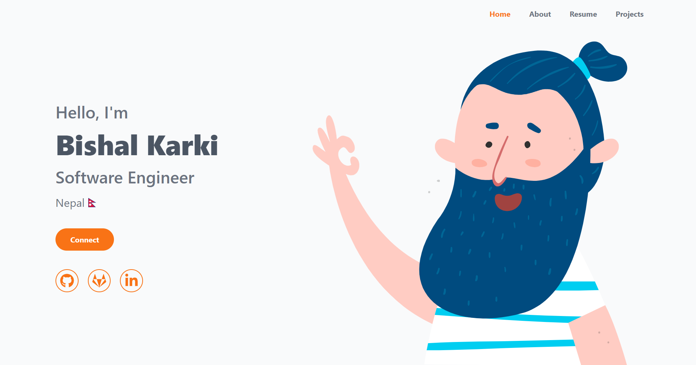

# Single Page Portfolio
Using React and Tailwind CSS

Live demo: https://kbishal.com.np/

The template data are organized in `src/data` folder into several `json` files.
The images are in `src/assets` folder. To use the template as it is, you can change
the images, and update the json files.

Install dependencies:
`npm install`

Run dev server: `npm run dev`

Run linter: `npm run lint:fix`

Build the project: `npm run build`